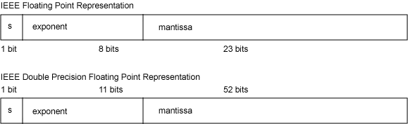
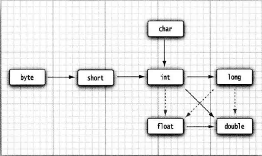
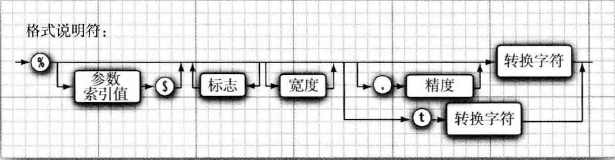

# ChapterOne JAVA的基本程序设计结构

## 8种基本类型

### 整型
|  类型   | 存储需求(字节) |     特殊标识      |
|:-----:|:--------:|:-------------:|
| byte  |    1     ||
| short |    2     ||
|  int  |    4     ||
| long  |    8     | 4000000000`L` |

#### 整型多进制表示方式

| 进制  |  前缀  |  样例  | 对应十进制 |
|:---:|:----:|:----:|:-----:|
|  2  | `0b` | 0b11 |   3   |
|  8  | `0`  | 010  |   8   |
| 16  | `0x` | 0x10 |  16   |
### 浮点型
|   类型   | 存储需求(字节) | 有效位数 |  特殊标识   |
|:------:|:--------:|:----:|:-------:|
| float  |    4     | 6-7位 | 3.14`F` |
| double |    8     | 15位  | 3.14`D` |


#### 特殊浮点数
1. 正无穷大 `Double(Float).POSITIVE_INFINITY`
2. 负无穷大 `Double(Float).NEGATIVE_INFINITY`
3. NaN `Double(Float).NaN`(并不是一个数值)
> ```java
> if (x == Double.NaN) // is never true  
> ```
> 所有“ 非数值” 的值都认为是不相同的。
>
> 然而， 可以使用Double.isNaN 方法：    
>
> ```java
> if (Double.isNaN(x)) // check whether x is "not a number"  
> ```

### 字符型(char型)
| 转义序列 | 名称  | Unicode 值 | 转义序列 | 名称  | Unicode 值 |
|:----:|:---:|:---------:|:----:|:---:|:---------:|
| `\b` | 退格  |  \u0008   | `\"` | 双引号 |  \u0022   |
| `\t` | 制表  |  \u0009   | `\'` | 单引号 |  \u0027   |
| `\n` | 换行  |  \u000a   | `\\` | 反斜杠 |  \u005c   |
| `\r` | 回车  |  \u000d   |
> 1. 由于转译发生在代码解析之前 所以会出现以下有趣的情况
> ```java
> public static void main(String\u005B\u005D args)  
> ```
> 就完全符合语法规则， \u005B 和\u005D 是`[`和`]` 的编码。
> 2. 以下并不是一个由引号（U+0022) 包围加号构成的字符串。实际上,\u0022会在解析之前转换为`"`， 这会得到也就是一个空串。
     > 更隐秘地，一定要当心注释中的`\u`。
>  ```java
> "\u0022+\u0022"
>  ```
> 3. 会产生一个语法错误，因为读程序时\u00A0会替换为一个换行符
> ```java
> // \u00A0 is a newline
> ```
> 4. 会产生一个语法错误，因为\u后面并未跟着4个十六进制数
> ```java
> // Look inside c:\users
> ```
> 5. char类型用于表示单个字符(情况已经发生变化 现在表示单个代码单元) 但是对于Unicode中一些字符来讲需要两个代码单元来表示 
> 一个代码单元就是一个字符类型 所以在将字符串转换成char数组时可能出现错误 由于JAVA SE 5.0开始 使用UTF-16字符集 每个
> 字符比如⑪码点为U+1D546, 编码为两个代码单元U+D835 和 U+DD46 所以字符串。

### 布尔类型(boolean型)
boolean(布尔)类型有两个值：`false`和`true` 
与C不同，用来判定逻辑条件整型值和布尔值之间不能进行相互转换。

```java
if (x = 0) // 无法通过编译
```

## 变量
### 变量/类命名规则
在Java中变量名的命名规则：
1. 以`字母`、下划线`_`、或者美元符`$`开头 isJavaIdentifierStart
   * isLetter() returns true
   * getType() returns LETTER_NUMBER
   * is a currency symbol (such as `$`)
   * is a connecting punctuation character (such as `_`).
2. 除开头外后面的部分可以有`字母`、下划线`_`、美元符`$`及`数字`组成 isJavaIdentifierPart it is a letter
   * it is a currency symbol (such as `$`)
   * it is a connecting punctuation character (such as `_`)
   * it is a digit
   * it is a numeric letter (such as a Roman numeral character)
   * it is a combining mark
   * it is a non-spacing mark
   * isIdentifierIgnorable(int)/isIdentifierIgnorable(codePoint) returns `true` for the code point
3. 区分大小写
4. 长度没有限制

注意：
1. 不能使用Java保留字作为变量名
2. `数字`包括 `0~9`和在某种语言中表示数字的任何Unicode字符
3. `字母`包括 `A~Za~z`或在某种语言中表示字母的任何Unicode字符
4. Java 9中，单下划线 _ 不能作为变量名
>可以使用Character类中的isJavaIdentifierStart和idJavaIdentifierPart方法字符是否为受支持的`字母`  
### 变量初始化
```java
int vacationDays = 12;
```
### 常量
java中利用关键字`final`修饰常量即变量的值不可修改
> 不可修改: 
> 基本类型 - 值不能改变 
> 对象 - 引用地址不能改变，但引用对象内的非`final`成员可以修改 
`const` 为java保留字 但目前并没有使用  
### 运算符

| 优先级 |                          运算符                           |                            简介                            |  结合性  |
| :----: | :-------------------------------------------------------: | :--------------------------------------------------------: | :------: |
|   1    |                        []、 .、 ()                        |                     方法调用，属性获取                     | 从左向右 |
|   2    | !、~、 ++、 --、+（正数）、-（负数）、(强制类型转换)  new |                         一元运算符                         | 从右向左 |
|   3    |                         * 、/ 、%                         |                    乘、除、取模（余数）                    | 从左向右 |
|   4    |                          + 、 -                           |                           加减法                           | 从左向右 |
|   5    |                       <<、 >>、 >>>                       |                 左位移、右位移、无符号右移                 | 从左向右 |
|   6    |               < 、<= 、>、 >=、 instanceof                | 小于、小于等于、大于、大于等于，对象类型判断是否属于同类型 | 从左向右 |
|   7    |                          == 、!=                          |              2个值是否相等，2个值是否不等于。              | 从左向右 |
|   8    |                             &                             |                           按位与                           | 从左向右 |
|   9    |                             ^                             |                          按位异或                          | 从左向右 |
|   10   |                          &#124;                           |                           按位或                           | 从左向右 |
|   11   |                            &&                             |                           短路与                           | 从左向右 |
|   12   |                       &#124;&#124;                        |                           短路或                           | 从左向右 |
|   13   |                            ?:                             |                         条件运算符                         | 从右向左 |
|   14   |    =、 += 、-= 、*= 、/=、 %=、 &=、^=、\|=、<<= 、>>=    |                       混合赋值运算符                       | 从右向左 |
#### 特殊运算符说明
> 整数被0除将会产生一个异常，而浮点数被0除将会得到无穷大或NaN结果。
> % 的计算公式 n % div = n - div * (int) (n / div) 所以对浮点数也生效 !注(int) -1.2 = -1 
> 因此当 n 为负数时 n % div 为负数 为了归化为整数使用 Math.floorMod(n,div)   

> 三目运算符会自动提升结果类型 
> 具体提升结果参见[自动类型提升](https://docs.oracle.com/javase/specs/jls/se8/html/jls-15.html#jls-15.25) 
> 包装类和基本类型在一起则会自动拆箱  

> Math 使用计算机浮点单元中的例程 所以在不同平台上可能产生不一样的结果 为此可以使用StrictMath确保计算结果可预测  

### 计算结果之间的转换
> 精度损失
> ```java
>  int n = 123456789;
>  float f = n; // f is 1.23456792E8  
> ```
> n 转换为二进制是111010110111100110100010101 = 1.11010110111100110100010101 * 2^11010 
> 由于float至多只能存储23位尾数 所以n被存储为1.11010110111100110100011 * 2^11010 
> 转换回去为 111010110111100110100011000 = 123456792  

> **尾数舍入规则** 
> 若超出可保存的23位的多余位大于等于100…01，这种情况下，舍入的方法是在尾数的最低有效位上加1； 
> 若多余位小于等于011…11，则直接舍去；
> 若多余位为100…00，此时再判断尾数的最低有效位的值(第23位)，若为0则直接舍去，若为1则再加1。

以下为自动类型转换 当进行二元运算时 变量类型会自动向上转型成一致 箭头方向为转换方向 虚线箭头表示会有精度损失


### 强制类型转换
(强制转换类型) 待转换对象
浮点数转整形直接截断小数位
布尔类型无法转换为数字

### 结合赋值和运算符
即优先级垫底的那一行 +=等
若运算结果与左侧不一致会自动发生强制类型转换
x += 3.5; 等于 x = (int) (x + 3.5)
### 自增与自减运算符 
即 ++、-- 由于会改变自身的值 所以不能跟在数值后面 如 4++ 同时 y = x++ 与 y = ++x也不一致
### 关系与boolean运算符
&& 与 || 为短路运算符 第一个表达式的值可以确定整个表达式的结果时 不进行第二个表达式的判断
### 位运算符
在对boolean值进行&或|运算时 结果与&&与||差不多 但是不是短路运算
移位运算的位数要进行模32运算 即 x >>>35 等于 x>>>3

### 枚举类型
对于只存在固定值的变量可以采用枚举类型
enum Size { SMALL, MEDIUM, LARGE, EXTRA LARGE };
## 字符串
JAVA预定义的类 Unicode字符序列
每次new一个字符串若常量池中不存在对应的字符串则会另外新建一个同样的字符串对象放在常量池中

### 子串 substring
substring(int beginIndex)
substring(int beginIndex, int endIndex)
```java
// 当指向的子串与当前串一致时 不新建串而是返回当前对象
return (beginIndex == 0) ? this : new String(value, beginIndex, subLen);
return ((beginIndex == 0) && (endIndex == value.length)) ? this: new String(value, beginIndex, subLen);
```
### 拼接 +/join
1. \+
拼接字符串 
```java
String expletive = "Expletive";
String PC13 = "deleted";
String message = expletive + PC13;
String message2 = "Expletive" + "deleted";
String message3 = "Expletivedeleted";
由于jvm优化2和3是同一个对象常量池
```
实质上 + 是由StringBuilder实现的
message等价于
```java
StringBuilder sb = new StringBuilder();
sb.append(expletive);
sb.append(PC13);
String message = sb.toString();
```
2. join
join(CharSequence delimiter, CharSequence... elements) 
join(CharSequence delimiter, Iterable<? extends CharSequence> elements) 
底层也是由StringBuilder实现的 
第一次增加元素新建一个新的StringBuilder 第二次及以后每次新增一个delimiter 
String.join(",","/") = "/" 
String.join(",","/","/") = "/,/"  
### 不可变字符串
String 实现是一个 final char[]数组所以一但创建以后不能修改  
### 比较 equals/compareTo
==用来比较两个对象是否为同一个 所以不建议用来比较字符串 
String s1 = new String("1"); 
String s2 = new String("1"); 
s1 != s2  

### 空串与null串
空串 “” 
null串 null  

### 代码单元与码元
由于String是由char数组实现的 所以每一个char即为一个代码单元 
而length返回的是代码单元的长度 与实际符号长度可能不一致 若要取得实际的码元需要使用codePoints 
码元序列用int序列代替 
int[] codePoints = str.codePoints().toArray();  

### 分割(不会有后缀空字符串)
",1,,1,1,".split(",") = [“”, “1”,“” , “1”, “1”]

> String 属于CharSequence的一种  

## 输入输出
### 输出到控制台
System.out.print()  
### 读取输入
Scanner in = new Scanner(System.in);
nextLine() 下一行字符串(以换行符为分隔符)
next() 下一个字符串(以空格为分隔符)
nextInt() 下一个整数
nextDouble() 下一个浮点数
除char外每种基本类型都有一个对应的读取next 除此之外还有BigDecimal及BigInteger对应的读取函数  

> Scanner 输入可见 
> Console 输入不可见 
> 以下代码在IDEA无法调试 需要在CMD中运行
> Console cons = System.console(); 
> String username = cons.readLine("User name: "); 
> char[] passwd = cons.readPassword("Password:");  
### 格式化输出
以 % 加上转换符进行格式化

| **转换符** | **类型**           |    **示例**     | **转换符** | **类型**      | **示例**                   |
|:-------:|:----------------:|:-------------:|:-------:|:-----------:|:------------------------:|
| d       | 十进制整数            |      159      | s       | 字符串         | hello                    |
| x       | 十六进制整数           |      9f       | c       | 字符          | H                        |
| o       | 八进制整数            |      237      | b       | 布尔          | true                     |
| f       | 定点浮点数            |     15.9      | h       | 散列码         | 42628b2                  |
| e       | 指数浮点数            |   1.59e+01    | tx或Yx   | 日期时间（T强制大写） | 已经过时，应当改为使用 java.time 类。 |
| g       | 通用浮点数(e和f中较短的一个) |      ——       | %       | 百分号         | %                        |
| a       | 16进制浮点数          |  0x1.fccdp3   | n       | 与平台有关的换行符   | ——                       |

同时还有标志进行进一步的格式化控制
%,a.bf 表示保留a位宽度 b位小数进行输出 以,作为分隔符进行千分位分隔

|   **标志**   |                    **目的**                    |               **示例**                |
|:----------:|:--------------------------------------------:|:-----------------------------------:|
|     +      |                  打印正数和负数的符号                  |              +3333.33               |
|     空格     |                  在正数之前添加空格                   |        &#124; 3333.33&#124;         |
|     0      |                    数字前面补0                    |              003333.33              |
|     -      |              左对齐（不指定-时，默认为右对齐）               |        &#124;3333.33 &#124;         |
|     (      |                   将负数括在括号内                   |            %d,-90输出(90)             |
|     ,      |                    （英文逗号）                    | 添加分组分隔符，只对定点浮点数整数部分添加分组分隔符，小数部分不会添加 |
|  #（对于f格式）  |                    包含小数点                     |               3,333.                |
| #（对于x或o格式） |                   添加前缀0x或0                   |               0xcafe                |
|     $      | 给定被格式化的参数索引。例如 ％n$d,％n$x 将以十进制和十六进制格式打印第n个参数 |               159 9F                |
|     <      |     格式化前面说明的数值。例如，%d%<x 将以十进制和十六进制打印同一个值     |               159 9F                |


## 文件输入与输出
#### 输入
```java
Scanner in = new Scanner(Paths.get("c:\\mydirectory\\myfile.txt") , "UTF-8");
```
### 输出
```java
PrintWriter out = new PrintWriter("myfile.txt", "UTF-8");// 用法与System.out基本一致
```
> 当在指定文件路径时使用相对路径 则 该路径由启动路径决定 如命令行执行则为当前命令行路径 
> 当采用命令行方式启动一个程序时， 可以利用Shell 的重定向语法将任意文件关联 
> 到System.in 和System.out:  输入重定向myfile.txt 输出重定向 output.txt
> java MyProg < myfile.txt > output.txt

## 控制流程
### 块作用域
用于确定变量的作用域  
### 条件语句
if(condition) statement 

if 与 最近的else匹配 
if (x <= 0) if (x == 0) sign = 0; else sign = -1; 
if (x <= 0) { if (x == 0) sign = 0; else sign = -1; }  

### 不确定循环语句
while(condition) statement 先判断后执行 
do statement while (condition); 先执行后判断

### 确定循环语句
for (int i = 1; i <= 10; i++) 
i的作用域为整个for循环体

### 多重选择
switch (choice) 
case 1: 
break；
。。。 
default: 
若没有default则会进入下一个case
`choice` 支持的类型(本质上都是对int的支持): 
枚举类、char、byte、short、int 和 Character、Byte、Short、Integer 和 String 
`case`支持的`常量` 
• 类型为char、byte、short 或int 的常量表达式。 
• 枚举常量。 
• 从Java SE 7 开始， case 标签还可以是字符串字面量。 
使用枚举类型时 不需要指定枚举名
Size sz = . . .;
switch (sz)
{
case SMALL: // no need to use Size.SMALL
}

### 中断流程控制语句
#### break
break用于退出当前循环 此外为了实现类似于goto的功能 java有一种带标签的break可以跳出多层循环  此外还可用于跳出任何块语句中
标签必须放在希望跳出的最外层循环之前，并且必须紧跟一个冒号。  
```java
    // break out of read_data loop
    int n = 0;
    read_data:
    while (true) {
      // this loop statement is tagged with the label
      for (int i = 0; i < 10; i++)
      // this inner loop is not labeled
      {
        System.out.print("Enter a number >= 0: ");
        n = in.nextInt();
        if (n < 0)
        // should never happen-can’t go on
        {
          break read_data;// break out of read_data loop
        }
      }
      // this statement is executed immediately after the labeled break
      if (n < 0)
        // check for bad situation
      {
        // deal with bad situation
      } else {
        // carry out normal processing
      }
    }
```
如下所示：
```java
label:
{
if (condition) break label; // exits block
}
// jumps here when the break statement executes
```
#### continue
continue 将控制转移到最内层循环的首部。例如：
```java
Scanner in = new Scanner(System.in);
while (sum < goal)
{
System.out.print("Enter a number: ");
n = in.nextInt();
if (n < 0) continue;
sum += n; // not executed if n < 0
}
```
如果将continue语句用于for循环中，就可以跳到for 循环的`更新`部分。例如，下面这个循环：
```java
for (count = 1; count <= 100; count++)
{
System.out.print("Enter a number, -1 to quit: ");
n = in.nextlnt()；
if (n < 0) continue;
sum += n; // not executed if n < 0
}
```
与break类似 有一种带标签的continue语句，将跳到与标签匹配的循环首部。
## 大数值
由于double与float的精度值有限，int等的大小范围有限 因此在java.math包内包含了两种可以处理任意长度数字序列的数值
BigInteger和BigDecimal
1. BigIntege
   • BigInteger add(BigInteger other) 
   • BigInteger subtract(BigInteger other) 
   • BigInteger multiply(BigInteger other) 
   • BigInteger divide(BigInteger other) 
   • BigInteger mod(BigInteger other) 
   • int compareTo(BigInteger other) 
   • static BigInteger valueOf(long x)  
2. BigDecimal
   • BigDecimal add(BigDecimal other) 
   • BigDecimal subtract(BigDecimal other) 
   • BigDecimal multiply(BigDecimal other) 
   • BigDecimal divide(BigDecimal other RoundingMode mode) 
   • int compareTo(BigDecimal other) 
   • static BigDecimal valueOf(long x) 
   • static BigDecimal valueOf(long x ,int scale)  
## 数组
新建数组可以使用int[] a或 int a[] = new int\[n\] 
另外可以使用匿名数组进行创建数组并初始化为想要的值int[] smallPrimes = { 2, 3, 5, 7, 11, 13 }; 
数组一旦创建大小不能改变 
数组类型初始化值 整型 0/浮点型0.0/对象null  

### for each循环
加强型for循环
for (variable : collection) statement
> collection 这一集合表达式必须是一个数组或者是一个实现了Iterable接口的类对象
### 数组拷贝
由于数组变量类似于对象 所以简单的赋值为浅拷贝

为了完全复制数组的值 且复制对象的改动不影响原对象 用以下方法进行复制 
int[] copiedLuckyNumbers = Arrays.copyOf(luckyNumbers, luckyNumbers.length); 
第二个参数值为新建数组的长度  

>`[]`运算符被预定义为检查数组边界，而且没有指针运算，即不能通过a加1得到数组的下一个元素。
### 命令行参数
每一个Java应用程序都有一个带String args[]参数的main方法。这个参数表明main方法将接收一个字符串数组，也就是命令行参数  
java Message -g cruel world对应的String args[]为
args[0] "g"
args[1] "cruel"
args[2] "world"

#### Arrays
• static String toString(type[] a)
• static type copyOf(type[] a, int length)
• static type copyOfRange(type[] a, int start, int end)
• static void sort(type[] a)
• static int binarySearch(type[] a, type v)
• static int binarySearch(type[] a, int start, int end, type v) 
• static void fill(type[] a, type v)
• static boolean equals(type[] a, type[] b)
### 不规则数组
1 
1 1 
1 2 1 
1 3 3 1 
1 4 6 4 1 
1 5 10 10 5 1 
1 6 15 20 15 6 1  

```java
int[][] odds = new int[NMAX + 1][];
for(int n = 0; n <= NMAX ; n++)
  odds[n] = new int[n + 1] ;
```
