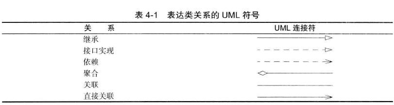

# ChapterTwo 对象与类

## 面向对象程序设计概述

### 类

模板

### 对象

- 对象的行为(behavior) — 可以对对象施加哪些操作，或可以对对象施加哪些方法？

- 对象的状态(state) — 当施加那些方法时，对象如何响应？ 

- 对象标识(identity)

如何辨别具有相同行为与状态的不同对象？

### 类之间的关系

- 依赖(“uses-a”)
- 聚合(关联）(“has-a”)
- 继承(“is-a”)

1. 依赖（dependence), 即“uses-a” 关系， 是一种最明显的、最常见的关系。例如，Order 类使用Account类是因为Order对象需要访问Account对象查看信用状态。
   因此，如果一个类的方法操纵另一个 类的对象，我们就说一个类依赖于另一个类。 应该尽可能地将相互依赖的类减至最少。如果类A不知道B的存在，它就不会关心B的任何改变（这意味着B的改变不会导致A产生任何bug)。用软件工程的术语来说， 就是让类之间的耦合度最小。
2. 聚合（aggregation), 即“has-a”关系，是一种具体且易于理解的关系。例如，一个Order对象包含一些Item对象。聚合关系意味着类A的对象包含类B的对象。
3. 继承（inheritance), 即“is-a” 关系，是一种用于表示特殊与一般关系的。例如，RushOrder类由Order 类继承而来。在具有特殊性的RushOrder
   类中包含了一些用于优先处理的特殊方法，以及一个计算运费的不同方法；而其他的方法，如添加商品、生成账单等都是从 Order 类继承来的。

#### UML图



## 使用预定义类

**Date**

### 对象与对象变量

构造器来构造对象并指定其初始状态 
构造器名与类名保持一致 是一种特殊的方法 
通过new关键字调用构造器新建对象 
Date birthday = new Date(); 
Date birthday; 

> 默认初始化为null（这是错误的，局部变量不会自动地初始化为null，也没有分配内存空间）

Date birthday = null与上一条不等 
所有的Java 对象都存储在堆中

### Java 类库中的LocalDate 类

Date类表示的是Gregorian 阳历表示法 格里高利历 表示距离UTC时间1970年1月1日00:00:00的毫秒数（可正可负） 不要使用构造器来构造LocalDate 类的对象。实际上，应当使用静态工厂方法(factory method) 来调用构造器。
LocalDate.now()
可以提供年、月和日来构造对应一个特定日期的对象：
LocalDate.of(1999, 12, 31)
一旦有了一个LocalDate 对象， 可以用方法getYear、getMonthValue 和getDayOfMonth 得到年、月和日：
Date类中也有getDay、getMonth 以及getYear等方法 但已被弃用

### 更改器方法与访问器方法

LocalDate aThousandDaysLater = newYearsEve.plusDays(1000); 这个调用之后newYeareEve并没有发生变化
而是会生成一个新的LocalDate 对象 更改原对象状态的方法就是更改器方法 只是访问原对象内的某些信息的方法即是访问器方法  
• static LocalTime now()
• static LocalTimeof (int year, int month, int day)
• int getYear() 
• int getMonthValue()
• int getDayOfMonth()
• DayOfWeek getDayOfWeek()
• LocalDate plusDays(int n)
• LocalDate minusDays(int n)
[LocalDate 与 Date区别(有空自己写一个)](https://blog.csdn.net/duan196_118/article/details/111597682)

## 用户自定义类

文件名必须与public类的名字相匹配。在一个源文件中，只能有一个公有类，但可以有任意数目的非公有类。

### 编译

用以下命令

```java
javac EmployeeTest.java
```

没有显式地编译Employee.java 然而，当Java编译器发现EmployeeTest.java使用了Employee类时会查找名为Employee.class的文件。
如果没有找到这个文件，就会自动地搜索Employee.java, 然后，对它进行编译。更重要的是：如果Employee.java版本较已有的
Employee.class文件版本新，Java编译器就会自动地重新编译这个文件。

### 构造器

• 构造器与类同名
• 每个类可以有一个以上的构造器(可以不显式声明 默认会有无参构造器)
• 构造器可以有0 个、1 个或多个参数
• 构造器没有返回值
• 构造器总是伴随着new 操作一起调用

> 不要在构造器中定义与实例域重名的局部变量。 public Employee(String n, double s)
{ String name = n; // Error double salary = s; // Error } 这个构造器声明了局部变量name和salary。这些变量只能在构造器内部访问。这些变量屏蔽了同名的实例域。
! 但是在Idea里试了一下并不会报错 局部变量确实覆盖了实例变量 用this来区分实例变量和局部变量

### 隐式参数与显式参数

```java
number007.raiseSalary(5);
```

以上语句中number007即是隐式参数，5为显式参数

### 封装的优点

注意不要编写返回引用可变对象的访问器方法。

```java
class Employee {

  private Date hireDay;

  public Date getHireDay() {
    return hireDay; // Bad
  }
}
```

Date 类有一个更改器方法setTime,可以在这里设置毫秒数，会破坏封装性。如果需要返回一个可变数据域的拷贝，就应该使用clone。

```java
class Employee {

  public Date getHireDay() {
    return (Date) hireDay.cloneO;
  }
}
```

### 基于类的访问权限

一个方法可以访问所属类的`所有`对象的私有数据

```java
class Employee {

  public boolean equals(Employee other) {
    return name.equals(other.name);
  }
}
```

other虽然是同一类的另外一个对象 但也能直接访问到其他对象的私有变量

### 私有方法

类似于私有变量 只允许类内对象访问

### final实例域

实例域定义为final。构建对象时必须初始化这样的域。
可以在实例域声明时赋值，也可以在构造期内赋值 但得保证确保在每一个构造器执行之后，这个域的值被设置，

```java
class Employee {

  private final String name = "211111";
  
  // 或
  Employee(){
    name = "";
  }
}
```
## 静态域和静态方法
### 静态域及静态常量
相对于实例域 每个对象保有一份实例域的拷贝 而静态域属于类 同一个类下的各个对象共享静态域 对静态域的修改也会同步到各个对象
同时静态域的初始化来自于类加载时 对象创建时不会初始化静态域
> 如果查看一下System类， 就会发现有一个setOut方法，它可以将System.out设置为不同的流。 setOut方法是一个本地方法，而不是用Java语言实现的。本地方法可以绕过Java语言的存取控制机制。
### 静态方法
静态方法是没有this这个隐式参数参数的方法，所以静态方法无法访问和更改`当前`类的实例域(但是可以访问和更改其他类的实例域)
### 工厂方法
静态方法还有另外一种常见的用途。类似LocalDate和NumberFormat的类使用静态工厂方法(factory method来构造对比如LocalDate.now 和LocalDate.of。
NumberFormat 类如下使用工厂方法生成不同风格的格式化对象:

```java
NumberFormat currencyFormatter = NumberFormat.getCurrencyInstance();
NumberFormat percentFormatter = NumberFormat.getPercentInstance()；
double x = 0.1;
System.out.println(currencyFormatter.format(x)); // prints $O.10
System.out.println(percentFomatter.format(x)); // prints 10%
```
为什么NumberFormat 类不利用构造器完成这些操作呢？
• 无法命名构造器。构造器的名字必须与类名相同。但是，这里希望将得到的货币实例和百分比实例采用不用的名字。
• 当使用构造器时，无法改变所构造的对象类型。而Factory方法将返回一个DecimalFormat类对象，这是NumberFormat的子类

### main方法

在程序启动时还没有任何一个对象。静态的main方法将执行并创建程序所需要的对象

## 方法参数

参数传递方式:

1. 值传递

   方法接收的是调用者提供的值

2. 引用传递

   方法接收的是调用者提供的变量地址

java是值传递 虽然可以修改对象内容 但是反例如下：

```java
public static void swap(Employee x , Employee y){ // doesn't work
    Employee temp = x;
    x = y;
    y = temp;
}
如果Java对对象采用的是按引用调用，那么这个方法就应该能够实现交换数据的效果：
Employee a = new Employee("Alice", . . .);
Employee b = new Employee("Bob", . . .);
swap(a, b);
// does a now refer to Bob, b to Alice?
```

• 一个方法不能修改一个基本数据类型的参数（即数值型或布尔型）。
• 一个方法可以改变一个对象参数的状态。
• 一个方法不能让对象参数引用一个新的对象。

## 对象构造

### 重载

如果多个方法（比如，StringBuilder 构造器方法）有相同的名字、不同的参数(指入参)[被称为方法签名]，便产生了重载。返回类型不是方法签名的一部分。也就是说，不能有两个名字相同、参数类型也相同却返回不同类型值的方法。

### 默认域初始化

如果在构造器中没有显式地给域赋予初值，那么就会被自动地赋为默认值：数值为0、布尔值为false、对象引用为null。

### 无参数的构造器

如果在编写一个类时没有编写构造器，那么系统就会提供一个无参数构造器。这个构造器将所有的实例域设置为默认值。但当用户自定义了一个有参构造器后，系统并不会默认提供无参构造器，若此时调用无参构造器则会报错。

### 显式域初始化

```java
class Employee{
	private String name =""
        ...
}
```

显式赋值操作会在构造器初始化之前

同时显式域初始化也可以使用函数

```java
class Employee{
	private static int nextId;
	private int id = assignId()；
	private static int assignId(){
    	int r = nextId;
    	nextId++;
    }
}
```

### 调用另一个构造器

除了作为隐式参数指向当前对象，this()可以调用其他的构造器 构造器的公共代码部分只需要编写一次

### 初始化块

只要构造类的对象，这些块就会被执行。

```java

class Employee{
	private static int nextId;
    
	private int id;
	private String name;
	private double salary;
	// object initialization block
	{
		id = nextId;
		nextId++;
    }
    
	public Employee(String n, double s){
        name = n;
		salary = s;
    }
	public Employee(){
        name = "";
        salary = 0;
    }
}
```

> 各种初始化方式运行顺序
>
> 1. 显式域初始化
>
> 2. 初始化块
>
> 3. 构造器
>
> 若有多个初始块则按代码顺序运行

> 静态域拥有和实例域近似的初始化方式
>
> 静态域初始化块增加static关键字
>
> ```java
> static
> {
> 	System.out.println("Hello, World") ;
> }
> ```

### 对象析构与finalize方法

有些面向对象的程序设计语言，特别是C++,有显式的析构器方法，其中放置一些当对象不再使用时需要执行的清理代码。在析构器中，最常见的操作是回收分配给对象的存储空间。由于Java 有自动的垃圾回收器，不需要人工回收内存，所以Java 不支持析构器。当然，某些对象使用了内存之外的其他资源，例如，文件或使用了系统资源的另一个对象的句柄。在这种情况下，当资源不再需要时，将其回收和再利用将显得十分重要。可以为任何一个类添加finalize方法。finalize方法将在垃圾回收器清除对象之前调用。在实际应用中，不要依赖于使用finalize方法回收任何短缺的资源，这是因为很难知道这个方法什么时候才能够调用。如果某个资源需要在使用完毕后立刻被关闭， 那么就需要由人工来管理。对象用完时，可以应用一个close方法来完成相应的清理操作。

## 包

域名倒序作为包名路径

### 类的导入

使用import关键字导入对应的类 或用通配符*导入某包路径下的所有类

```java
import java.time.LocalDate;
import java.time.*;
```

但是,只能使用星号`*`导入一个包，而不能使用import java.\*; 或import java.\*.\* 导入以java为前缀的所有包。

当代码中需要用到不同包中的同名类时

> 在包中定位类是编译器(compiler)的工作。类文件中的字节码肯定使用完整的包名来引用其他类。

### 静态导入

import还能导入静态类及静态方法

```java
import static java.lang.System.*;

out.println("Goodbye, World!"); // i.e., System.out
exit(0); //i.e., System.exit
```

out为System类的静态域

### 将类放入包中

要想将一个类放人包中， 就必须将包的名字放在源文件的开头，包中定义类的代码之前，以关键字`package`开始

```java
package com.horstmann.corejava;

public class Employee{
    ...
}
```

如果没有在源文件中放置package语句，这个源文件中的类就被放置在一个默认包(defaulf package)中。默认包是一个没有名字的包。

#### 编译根目录

从运行类或测试类所在类作为目录作为编译根目录 或以包含所有用户包的根目录进行编译

1. ```bash
   javac PackageTest.java
   ```
   

2. ```bash
   javac com/mycompany/PayrollApp.java
   java com.mycompany.PayrollApp
   ```
   
   

注意`javac`编译时为路径分隔符`/`及带有后缀`.java`

`java`运行时为`.`分隔符

> 编译器在编译源文件的时候不检查包的目录结构。例如，假定有一个源文件开头有下列语句
>
> ```java
> package com.mycompany;
> ```
> 即使这个源文件没有在子目录com/mycompany下，也可以进行编译。如果它不依赖于其他包，就不会出现编译错误。但是，最终的程序将无法运行，除非先将所有类文件移到正确的位置上。如果包与目录不匹配，虚拟机就找不到类。

### 包作用域

| **修饰符** | **当前类** | **同一包内** | **子孙类(不同包)** | **其他包** |
| :--------: | :--------: | :----------: | :----------------: | :--------: |
|   public   |     Y      |      Y       |         Y          |     Y      |
| protected  |     Y      |      Y       |        Y/N         |     N      |
|  default   |     Y      |      Y       |         N          |     N      |
|  private   |     Y      |      N       |         N          |     N      |

所有访问权限控制以访问对应变量/方法位置为准

#### 公有访问修饰符 - `public`

#### 受保护的访问修饰符 - `protected`

protected 需要从以下两个点来分析说明：

- **子类与基类在同一包中**：被声明为protected的变量、方法和构造器能被同一个包中的任何其他类访问；
- **子类与基类不在同一包中**：那么在子类中，子类实例可以访问其从基类继承而来的protected方法，而不能访问基类实例的protected方法。

protected **不能修饰类（内部类除外）**。

接口及接口的成员变量和成员方法不能声明为protected。 

#### 默认访问修饰符 - 不使用任何关键字

接口里的变量都隐式声明为 **public static final**,而接口里的方法默认情况下访问权限为 **public**。

#### 私有访问修饰符 - `private`

类和接口不能声明为 **private**。

## 类路径

JAR文件使用ZIP格式组织文件和子目录

为了使类能够被多个程序共享，需要做到下面几点：
1. 把类放到一个目录中，例如/home/user/classdir。需要注意，这个目录是包树状结构
的基目录。如果希望将com.horstmann.corejava.Employee 类添加到其中，这个Employee.class
类文件就必须位于子目录/home/user/classdir/com/horstmann/corejava 中。
2. 将JAR 文件放在一个目录中， 例如：/home/user/archives。
3. 设置类路径（classpath)。类路径是所有包含类文件的路径的集合。

在`UNIX`环境中，类路径中的不同项目之间采用冒号`:`分隔：
/home/user/classdir:.:/home/user/archives/archive.jar
在`Windows`环境中，则以分号`;`分隔：
c:\classdir;.;c:\archives\archive.jar
在上述两种情况中，句点`.`表示当前目录。

类路径包括：
• 基目录
/home/user/classdir或c:\classes；
• 当前目录`.`；
• JAR文件
/home/user/archives/archive.jar或c:\archives\archive.jar

从Java SE 6开始，可以在JAR文件目录中指定通配符，如下：
/home/user/classdir:.:/home/aser/archives/'\*'
或者
c:\classdir;.;c:\archives\\*
但在`UNIX`中，禁止使用\*以防止shell 命令进一步扩展(向子文件夹无限递归查询)。

运行时库文件(rt.jar和在jre/lib与jre/lib/ext目录下的一些的JAR文件)会被自动地搜索，所以不必将它们显式地列在类路径中。

> javac编译器总是在当前的目录中查找文件，但Java虚拟机仅在类路径中有`.`目录的时候才查看当前目录。如果没有设置类路径，那也并不会产生什么问题，默认的类路径包含目录`.`然而如果设置了类路径却忘记了包含目录，则程序仍然可以通过编译，但不能运行。
>
> **类路径示例：**
>
> 1. **虚拟机寻径**
>
>    /home/user/classdir:.:/home/user/archives/archive.jar
>    假定虚拟机要搜寻`com.horstmann.corejava.Employee`类文件。
>
>    1. 它首先要查看存储在jre/lib和jre/lib/ext目录下的归档文件中所存放的系统类文件。显然 在那里找不到相应的类文
>       件，然后再查看类路径。
>
>    2. 然后查找以下文件：
>       • /home/user/classdir/com/horstmann/corejava/Employee.class
>       • 从当前目录开始查找 com/horstmann/corejava/Employee.class
>       • /home/user/archives/archive.jar 从当前jar包内寻找 com/horstmann/corejava/Employee.class
>
> 2. **编译器寻径**
>
>   编译器定位文件要比虚拟机复杂得多。如果引用了一个类，而没有指出这个类所在的包，那么编译器将首先查找包含这个类的包，并查询所有的import指令，确定其中是否包含了被引用的类。
>
>   例如，假定源文件包含指令：
>   import java.util.\*;
>   import com.horstmann.corejava.\*;
>   并且源代码引用了Employee类。编译器将试图查找java.lang.Employee(因为java.lang包被默认导入)、java.util.Employee、com.horstmann.corejava.Employee 和当前包中的Employee。

### 设置类路径
1. 最好采用`-classpath(或-cp)`选项指定类路径：
   ```bash
   java -classpath /home/user/dassdir:.:/home/user/archives/archive.jar MyProg
   java -classpath c:\classdir;.;c:\archives\archive.jar MyProg
   ```

2. 通过设置CLASSPATH环境变量

   ```bash
   export CLASSPATH=/home/user/classdir:.:/home/user/archives/archive.jar
   set CLASSPATH=c:\classdir;.;c:\archives\archive.jar
   ```
   

## 文档注释
JDK 包含一个很有用的工具，叫做javadoc,它可以由源文件生成一个HTML文档。

### 注释的插入
 javadoc实用程序(utility)从下面几个特性中抽取信息：
 • 包
 • 公有类与接口
 • 公有的和受保护的构造器及方法
 • 公有的和受保护的域

应该为上面几部分编写注释、注释应该放置在所描述特性的前面。注释以`\**`开始，并以`*/`结束。
每个`/**...*/ `文档注释在标记之后紧跟着自由格式文本(free-form text)。标记由@开始，如@author(作者)或@param(参数)。自由格式文本的第一句应该是一个概要性的句子。javadoc实用程序自动地将这些句子抽取出来形成概要页。
在自由格式文本中，可以使用HTML修饰符，例如，用于强调的`<em>...</em>`、用于着重强调的`<strong>...</strong>` 以及包含图像的`` 等。不过，一定不要使用`<h1>` 或`<hr>`, 因为它们会与文档的格式产生冲突。若要键入等宽代码， 需使用`{@code ...}`而不是`<code...</code>`—这样一来， 就不用操心对代码中的`<`字符转义了。

### 类注释

类注释必须放在import语句之后，类定义之前。

多行类注释可以在行间选择加或不加`*`

```java
/**
* A {©code Card} object represents a playing card , such
* as "Queen of Hearts". A card has a suit (Diamond, Heart ,
* Spade or Club) and a value (1 = Ace, 2 . . . 10, 11 = Jack,
* 12 = Queen , 13 = King)
*/
public class Card{
    
}
/**
  A <code>Card< / code> object represents a playing card , such
  as "Queen of Hearts". A card has a suit (Diamond， Heart ,
  Spade or Club) and a value (1 = Ace, 2 . . . 10, 11 = jack ,
  12 = Queen, 13 = King).
*/
```

### 方法注释

除了通用标记之外的标注

1. `@param` 入参
   这个描述可以占据多行,并可以使用HTML标记。一个方法的所有`@param`标记必须放在一起。
2. `@return` 返回
   这个描述可以跨越多行,并可以使用HTML标记。
3. `@throws` 可能抛出异常

### 域注释

```java
/**
* The "Hearts" card suit
*/
public static final int HEARTS = 1;
```

### 通用注释

1. `@author` 姓名

2. `@version` 版本号

3. `@since` 特性引入版本

4. `@deprecated` 标记为废弃并提供替代意见

   ```java
   @deprecated Use <code>setVIsible(true)</code> instead
   ```

5. `@see` 

   ```java
   @see com.horstraann.corejava.Employee#raiseSalary(double)
   可以省略包名和类名，此时，链接将定位于当前包或当前类
   @see <a href="www.horstmann.com/corejava.html">The Core Java home page</a>
   @see "Core Java 2 volume 2"
   ```

6. `@link`

   特性描述规则与@see标记规则一样。不同的是`@link`可以放置于其他注释中

   ```java
   {@link package.class#feature label}
   ```

### 包与概述注释

在每一个包目录中添加一个单独的文件。

1. 提供一个以package.html命名的HTML文件。在标记<body>...</body> 之间的所有文本都会被抽取出来。
2. 提供一个以package-info.java 命名的Java 文件。这个文件必须包含一个初始的以`/**`和`*/`界定的Javadoc注释，跟随在一个包语句之后。它不应该包含更多的代码或注释。这个注释将被放置在一个名为overview.html的文件中，这个文件位于包含所有源文件的父目录中。

### 注释的抽取(生成)

假设HTML文件将被存放在目录docDirectory下。执行以下步骤：

1. 切换到包含想要生成文档的源文件目录。

2. - 如果是一个包，应该运行命令:

     ```bash
     javadoc -d docDirectory nameOfPackage
     ```

   - 或对于多个包生成文档，运行:

     ```bash
     javadoc -d docDirectory nameOfPackage1 nameOfPackage2 ...
     ```

   - 如果文件在默认包中，就应该运行：

     ```bash
     javadoc -d docDirectory *.java
     ```

其他常用指令：

* `-author` 包含@author 默认省略

* `-version` 包含@version 默认省略

* `-link`

  ```bash
  javadoc http://docs.oracle.com/javase/8/docs/api *.java
  ```

  那么，所有的标准类库类都会自动地链接到Oracle 网站的文档。

* `-linksource` 每个源文件被转换为HTML(不对代码着色，但包含行编号)，并且每个类和方法名将转变为指向源代码的超链接。

### 类设计技巧

1. 保证数据私有

2. 保证数据初始化
最好不要依赖于系统的默认值，而是应该显式地初始化所有的数据。

3. 不要在类中使用过多的基本类型，用其他的类代替多个相关的基本类型的使用。

  例如，用一个称为Address的新的类替换一个Customer 类中以下的实例域：
  private String street;
  private String city;
  private String state;
  private int zip;

4. 不是所有的域都需要独立的访问器和更改器

5. 将职责过多的类进行分解 拆分成具有对象特点的类

  ```java
  /**
    bad design
  */
  public class CardDeck
  {
      private int[] value;
      private int[] suit;
      public CardDeck(){...}
      public void shuffle() {...}
      public int getTopValue() {...}
      public int getTopSuit() {...}
      public void draw() {...}
  }
  /**
    good design
  */
  public class CardDeck
  {
      private Card[] cards;
      public CardDeck() {...}
      public void shuffle() {...}
      public Card getTop() {...}
      public void draw() {...}
  }
  public class Card
  {
      private int value;
      private int suit;
      public Card(int aValue, int aSuit) {...}
      public int getValue() {...}
      public int getSuit() {...}
  }
  ```

  

6. 类名和方法名要能够体现它们的职责
    命名类名的良好习惯是采用一个名词(Order)、前面有形容词修饰的名词(RushOrder)或动名词(有"-ing"后缀)修饰名词(例如BillingAddress)。

7. 优先使用不可变的类
防止并发修改时影响操作，但也不绝对